# Midterm Project – CRUD API using Node.js and File System

---

## 👋 About Me

Hi! I'm Shiela Mae Miclat, a 3rd Year BSIS student from La Verdad Christian College.  
This is my midterm project for our AppDev2 class.

---

## 📚 Project Overview

This project is a simple RESTful API that performs CRUD operations on a list of todos.

It's built using:

- Node.js (no frameworks)
- `http`, `fs`, and `events` modules
- JSON file as a fake database
- Logs requests to `logs.txt`

---

## 📚 API Endpoints

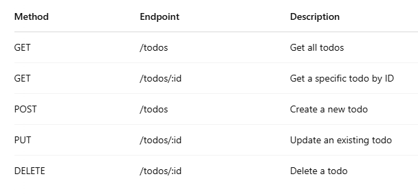

---

## 🚀 How to Run the Project

### 1.  **Clone** or **download** the project

### 2.  Open the **terminal** in the project folder

### 3. 🟢 **Start the Server** In the terminal:

**You should see:**

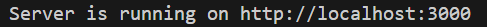

***Use Thunder Client or Postman***

### 4. 📄  `GET /todos` -- **Fetch all todos**

**Response:**

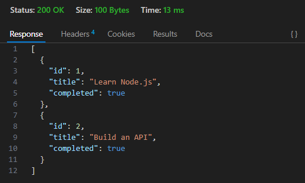

### 5. 🔍 `GET /todos/:id` -- **Fetch a specific todo**

**Response:**

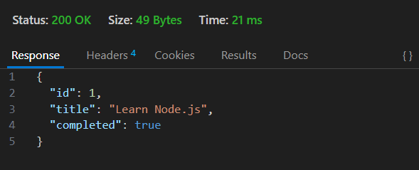

### 6. ➕ `POST /todos` -- **Create a new todo**

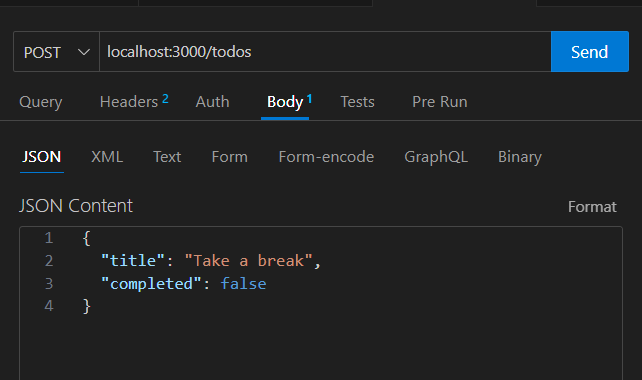

**Response:**

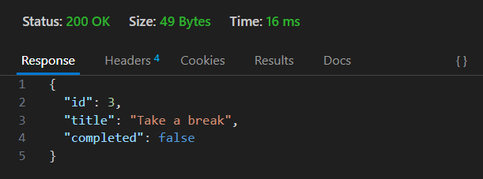

### 7. ✏️ `PUT /todos/:id` -- **Update an existing todo**

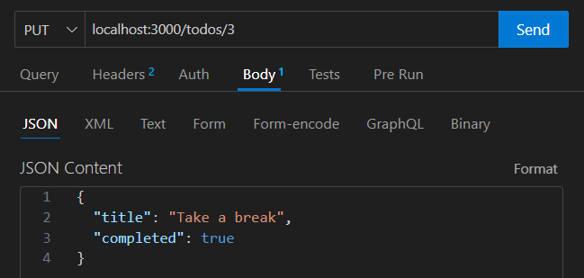

**Response:**

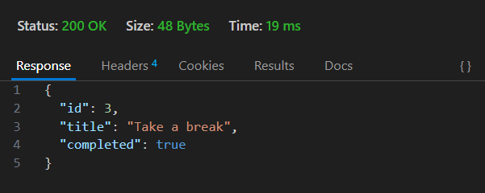

### 8. ❌ `DELETE /todos/:id` -- **Delete a todo**

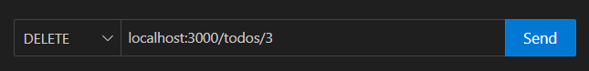

**Response:**

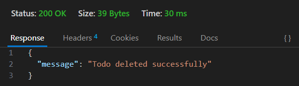

---

🧾 **#Logging**

All requests are logged to `logs.txt` in this format:

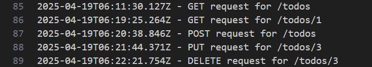

---

**# 📹 Demo Video**

📹 [Click here to watch the demo on Google Drive](https://drive.google.com/drive/u/0/folders/1GVLAeajqrpXy5xVZHvTpLZu773f2ruQ1)

